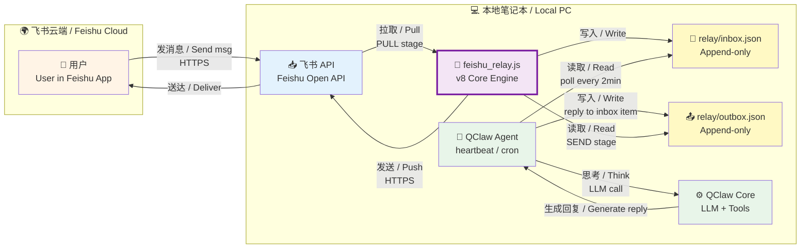

# 🏗 架构原理 / Architecture

> 本文档中英双语对照，左侧中文 / English on the right
> This document is bilingual. Chinese on the left, English on the right.

---

## 🌐 核心问题 / Core Problem

**🇨🇳 中文：**

大多数 QClaw + 飞书集成方案要求：
1. **公网可访问的服务器**（接收飞书事件回调）
2. **固定 IP 或域名**（配置飞书事件订阅）

这对没有云服务器的普通用户是硬门槛。

**烽火台的核心创新**：用 **Append-only 文件** 代替 **公网事件回调**，彻底绕开公网 IP 需求。数据流向不再依赖 webhook，而是靠本地文件系统"传纸条"。

**🇺🇸 English:**

Most QClaw + Feishu integration solutions require:
1. **A publicly accessible server** (to receive Feishu event webhooks)
2. **A fixed IP or domain** (to configure Feishu event subscriptions)

These are hard barriers for users without cloud servers.

**Beacons's core innovation**: replace **public event webhooks** with **append-only local files**. The data flow no longer depends on webhooks — it passes notes through the local file system.

---

## 🗺️ 架构图 / Architecture Diagram

---

## 🔄 三阶段单向数据流 / Three-Stage Unidirectional Data Flow

| 阶段 / Stage | 输入 / Input | 输出 / Output | 文件 / File | 频率 / Frequency |
|---|---|---|---|---|
| **PULL** 📥 | 飞书群新消息 New group messages | inbox JSONL 追加 Append to inbox | `relay/feishu_inbox.json` | 每 2 分钟 Every 2 min |
| **SEND** 📤 | outbox 条目 Outbox entries | 飞书 API 推送 Push to Feishu | `relay/feishu_outbox.json` | 同 PULL Same as PULL |
| **LEAK** 🛡 | 超时未回复 Timed-out items | 强制补回 Force enqueue | 同上 Same as above | 同 PULL Same as PULL |

**🇨🇳 中文说明：**
- 每个阶段都是单向流动，**不会出现循环写**
- QClaw Agent 通过文件系统读取 inbox、写入 outbox，**永远不会直接调用飞书 API**
- 飞书↔本地通信完全由 `feishu_relay.js` 把关，避免双向写入冲突

**🇺🇸 English:**
- Each stage flows in one direction only — **no circular writes**
- The QClaw Agent reads inbox and writes outbox through the file system — **never directly calls the Feishu API**
- All Feishu↔local communication is gated by `feishu_relay.js`, avoiding bidirectional write conflicts

---

## 🧠 为什么叫"Append-only"？ / Why "Append-only"?

**🇨🇳 中文：**

文件只能"追加"，不能"修改"或"删除"。这带来三个核心好处：

1. **零冲突** — 两端永远往文件末尾加条目，从不修改历史记录
2. **崩溃可恢复** — 进程意外退出，重启后继续追加即可，不丢数据
3. **人工可读** — 文件就是聊天记录，可以直接 `cat` 看

**🇺🇸 English:**

Files can only be **appended to**, never modified or deleted. This brings three core benefits:

1. **Zero conflicts** — Both sides only add entries at the end, never modify history
2. **Crash-recoverable** — If the process crashes, just resume appending on restart — no data loss
3. **Human-readable** — The file IS the chat log; `cat` it directly

---

## 🔐 安全设计 / Security Design

| 防护层 Layer | 机制 Mechanism | 文件 / File |
|---|---|---|
| 重复发送防护 Duplicate send prevention | sentIds 持久化去重 sentIds persistence | `relay/feishu_sentIds.json` |
| 已处理消息追踪 Processed message tracking | messageId 去重 messageId dedup | `bot-router/processed.json` |
| 漏回强制补回 Leak auto-reply | 4 分钟超时 + 自动 enqueue 4-min timeout + auto enqueue | 同上 Same |
| Token 容错 Token fault-tolerance | 自动刷新 + 重试 Auto refresh + retry | 内存 In-memory |
| Schema 防腐化 Schema anti-corruption | 结构检测 + 硬重置 Structure check + hard reset | 同上 Same |

---

## 🚧 技术限制 / Technical Limitations

**🇨🇳 中文：**

- **消息类型**：仅支持 text（其他类型如 image/file/card 会显示为 `[类型]` 占位）
- **API 限流**：飞书 API 限流约 100 次/分钟，本脚本远低于该阈值
- **Token 有效期**：飞书 tenant_access_token 有效期 2 小时，relay 每次运行自动刷新
- **单文件风险**：inbox/outbox 是单一文件，超过 10MB 时建议手动归档（滚动到 `*.archive.json`）

**🇺🇸 English:**

- **Message types**: Only text is supported (image/file/card will appear as `[type]` placeholder)
- **API rate limit**: Feishu API limit is ~100 req/min, this script is well under that threshold
- **Token lifetime**: Feishu tenant_access_token expires in 2 hours; relay refreshes it on every run
- **Single-file risk**: inbox/outbox are single files; when over 10MB, archive manually to `*.archive.json`

---

## 🛠 扩展方向 / Extension Points

如果要把 Beacon 适配其他 IM（微信/钉钉/Slack），只需替换两处：

1. **`FeishuClient`** → 改成 `WeChatClient` / `DingTalkClient` / `SlackClient`
2. **`targetChats`** → 改成对应平台的 chat ID 格式

其他三层（`StateManager` / `RelayCore` / 三阶段流程）**完全平台无关**，可直接复用。

**🇺🇸 To extend Beacon to other IMs (WeChat / DingTalk / Slack), only two places need to change:**

1. **`FeishuClient`** → rename to `WeChatClient` / `DingTalkClient` / `SlackClient`
2. **`targetChats`** → use the chat ID format of that platform

The other three layers (`StateManager` / `RelayCore` / three-stage flow) are **completely platform-agnostic** and can be reused directly.